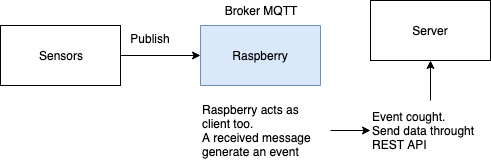

# raspitesi
Ambient part for my master's degree thesis project.

SpringBoot app run on RaspberryPI 3B+ that subscribe on certain MQTT topic and forward every message received via HTTP request.

Sensor are based on ESP8266 and runs Tasmota
